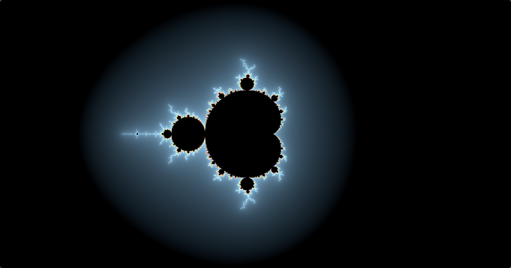

# Rust Mandelbrot

This application is a simple [fractal](https://en.wikipedia.org/wiki/Fractal) [Mandelbrot set](https://en.wikipedia.org/wiki/Mandelbrot_set) generator. It uses [`winit`](https://crates.io/crates/winit) crate for the window and [`pixels`](https://crates.io/crates/pixels) crate for manipulating the pixels on the window.

## Todo List

This will be the things I want to implement on the future to this application.

- [x] Use the [`log`](https://docs.rs/log/latest/log/) crate for logging.
- [x] Be able to control the zooming and panning on the window.
- [ ] Be able to control the color scheme.
- [ ] Be able to save the fractal as an image.
- [x] Use the GPU for rendering the fractal. Currently, it's using the CPU.
